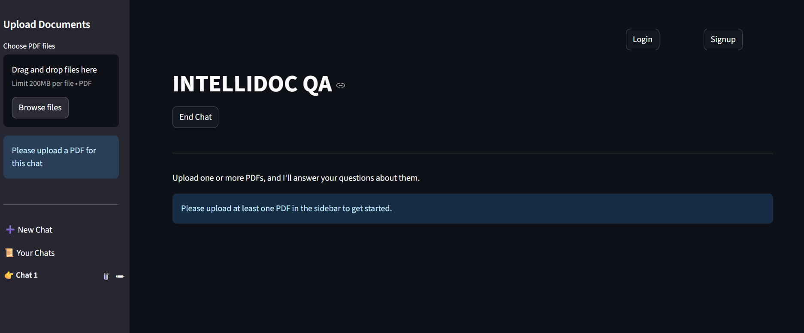
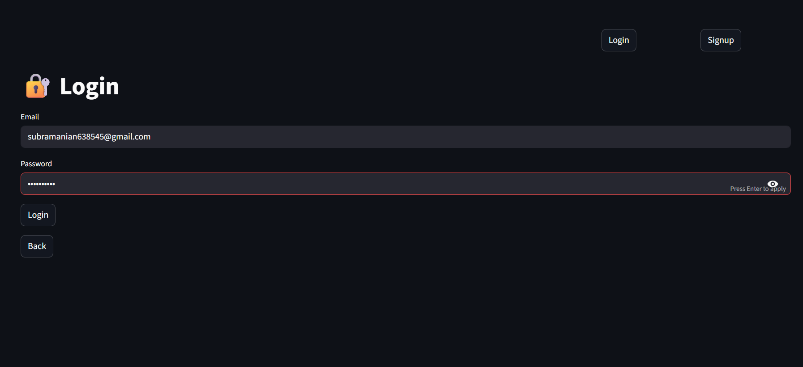
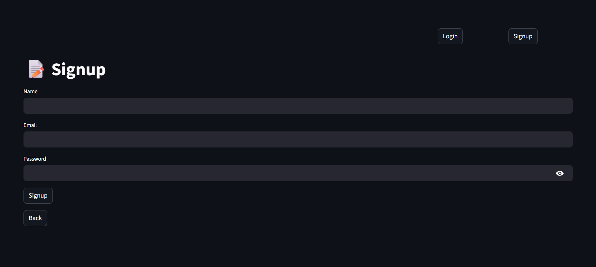
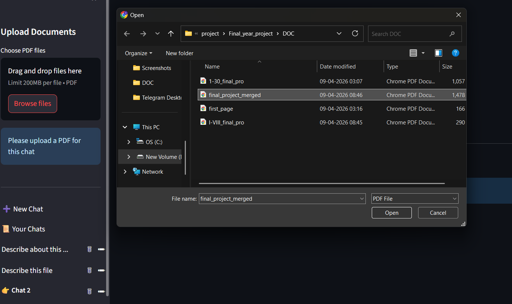
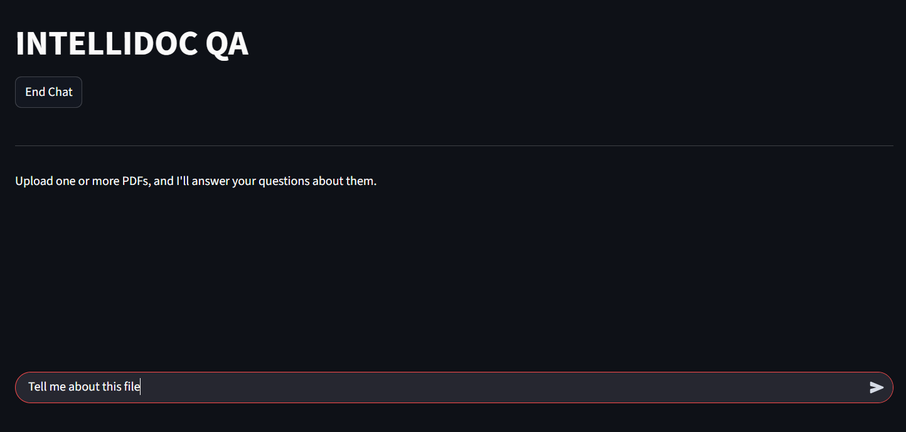
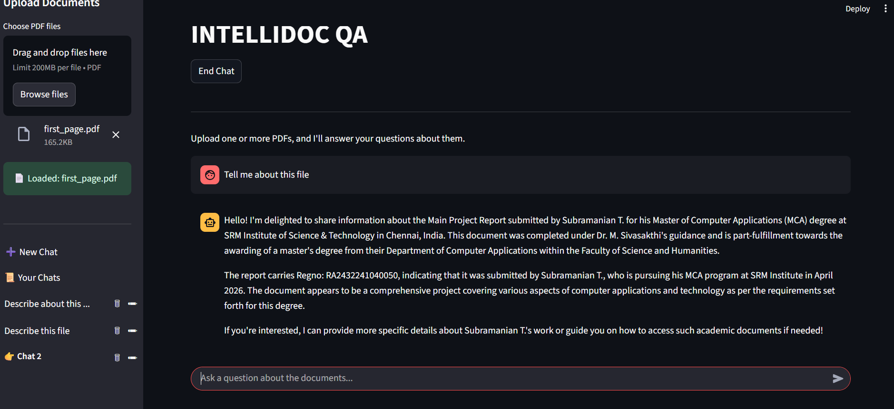
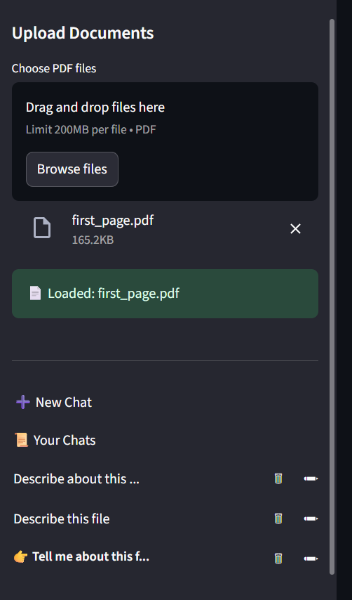
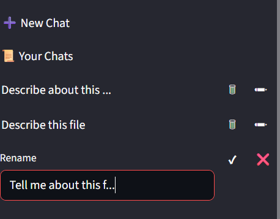

# 📄 INTELLIDOC QA

### AI-Powered Document Question Answering System (RAG-Based)

---

## 🚀 Overview

INTELLIDOC QA is an AI-powered document question answering system that allows users to upload PDF documents and interact with them using natural language queries. The system uses a **Retrieval-Augmented Generation (RAG)** approach to provide accurate, context-aware answers based on document content.

It combines semantic search with a local Large Language Model (LLM) to ensure privacy, efficiency, and cost-effectiveness.

---

### 🏠 Home Screen 



---

### 🔐 Login Screen 



---

### 📝 Signup Screen 



---

### 📄 File Upload 



---

### 💬 Chat Interface 



---

### 🤖 AI Response  



---

### 📂 Sidebar (Multi Chat) 



---

### ✏️ Rename & Delete Chat  


---

## ✨ Features

* 📄 Upload and analyze PDF documents
* 💬 Chat with documents using natural language
* 🧠 Context-aware answers using RAG architecture
* 🔐 User authentication (Signup/Login)
* 📂 Multi-chat support (like ChatGPT)
* 🗂 Chat history persistence (database integration)
* ☁️ File storage using Supabase
* ⚡ Lazy loading for efficient retriever creation
* 🔒 Secure credential management using `.env`

---

## 🏗️ System Architecture

1. User uploads PDF
2. Text is extracted and split into chunks
3. Embeddings generated using MiniLM
4. Stored in FAISS vector database
5. User query → similarity search
6. Relevant chunks + query → LLM (Ollama)
7. Context-aware response generated

---

## 🛠️ Tech Stack

* **Frontend:** Streamlit
* **Backend:** Python
* **Database:** PostgreSQL (Supabase)
* **Storage:** Supabase Storage
* **Embeddings:** Sentence Transformers (MiniLM)
* **Vector Store:** FAISS
* **LLM:** Ollama (Local Model)
* **Authentication:** bcrypt
* **PDF Processing:** PyMuPDF

---

## 📁 Project Structure

```
INTELLIDOC_QA/
│
├── app.py
├── auth.py
├── db.py
├── storage.py
├── requirements.txt
├── .env
├── .gitignore
│
├── rag/
├── utils/
├── static/
```

---

## ⚙️ Installation

### 1. Clone Repository

```
git clone https://github.com/your-username/INTELLIDOC-QA.git
cd INTELLIDOC-QA
```

---

### 2. Create Virtual Environment

```
python -m venv venv
venv\Scripts\activate
```

---

### 3. Install Dependencies

```
pip install -r requirements.txt
```

---

### 4. Setup Environment Variables

Create `.env` file:

```
SUPABASE_URL=your_url
SUPABASE_KEY=your_key

DB_HOST=your_host
DB_NAME=your_db
DB_USER=your_user
DB_PASSWORD=your_password
DB_PORT=5432
```

---

### 5. Run Application

```
streamlit run app.py
```

---

## 🔐 Security

* Credentials stored using environment variables
* Passwords hashed using bcrypt
* `.env` file excluded from GitHub

---

## 📊 Use Cases

* 📚 Students & Researchers
* 🏢 Enterprise document analysis
* 📑 Legal/Technical document review
* 📖 Knowledge management systems

---

## 🚀 Future Enhancements

* Support for multiple file formats (DOCX, TXT)
* Cloud deployment (Render / Streamlit Cloud)
* Advanced search & filtering
* AI-based chat title generation
* Persistent vector database

---

## 👨‍💻 Author

**Subramanian T**
MCA Student

---

## ⭐ If you like this project

Give it a ⭐ on GitHub!
